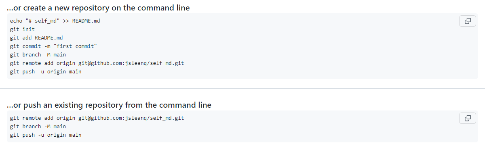
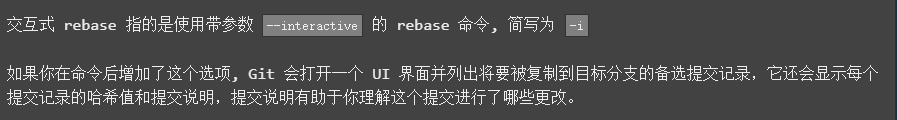
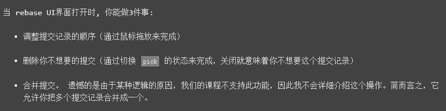

# Git基本操作

###Github等平台建立仓库

SSH Key与Github平台连接

在Github上建立仓库，复制仓库地址 git@github.com:XXX

默认分支：main（之前是master）

### 本地文件处理

1.将文件夹初始化：`git init`

2.添加文件：`git add . `（空格，提交全部文件/文件名）

3.提交本地文件：`git commit -m "注释/标识"`

### 远程仓库操作

1.连接远程仓库：`git remote add origin git@github.com:XXX`

2.克隆远程仓库：`git clone git@github.com:XXX`

3.提交到远程仓库，先切换到本地分支：（远程分支：remote_branch，本地分支：local_branch）

​	a.远程已有分支并且已经关联本地分支：`git push` 

​	b.远程已有分支但未关联本地分支：` git push -u origin remote_branch`

​	c.远程没有分支:` git push origin local_branch:remote_branch`

4.下载分支：`git fetch`（下载远程分支，不影响本地仓库和分支）

5.下载合并分支：`git pull`（下载且合并远程分支，= git fetch + git pull）

### 分支管理

1.创建并切换到 branch_1 分支：`git checkout -b branch_1/git switch -c branch_1`（尽量用switch）

2.删除分支：`git checkout -d branch_1`

3.查看分支：`git branch`

4.切换分支：`git checkout branch_name/ git switch branch_name`

5.合并分支：

`git merge branch_name`  （把branch_name分支上的内容合并到当前分支）

`git rebase branch_name`  （把当前分支上的内容创建副本合并到branch_name分支上）

`git branch -f main HEAD~n  `（强制将main分支指向HEAD的上n个提交位置）

###**提交管理**

1.HEAD:通常情况下是指向分支名

- 分离HEAD：`git checkout/switch C4`  指向提交记录
- 相对移动：`git checkout/switch HEAD^/HEAD~n `

2.撤销提交更改

`git reset local^/local~n` （撤销本地提交，回到上一层/上n层）

`git revert pushed`（撤销远程提交，当前指向的提交为上一层

3.整理提交记录

`git cherry-pick <提交号> ...` （将多个提交复制到当前位置（HEAD）下，**知道提交记录和记录的哈希值**）

`git rebase -i HEAD^n/HEAD~n` （进入rebase交互界面，对HEAD上一/n个记录进行修改）

### 其他命令

1.查看仓库状态：`git status `

2.查看文件修改：`git diff file_name`

### 常用工具

- lazygit（https://github.com/jesseduffield/lazygit）
- sourcetree（https://www.sourcetreeapp.com/）
