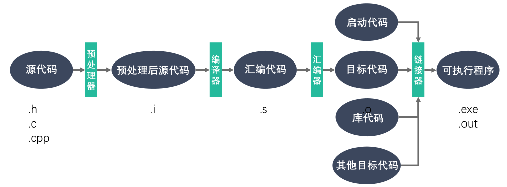
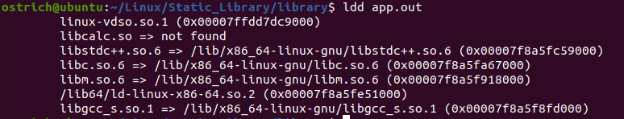
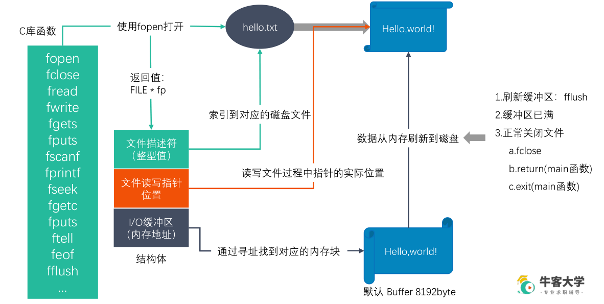
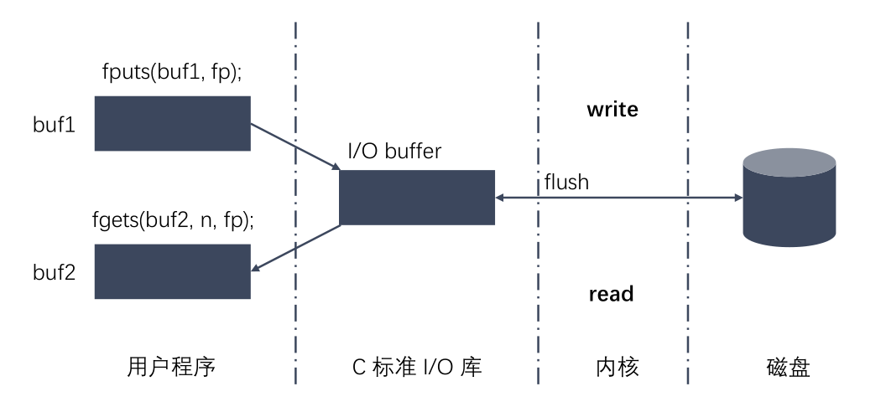
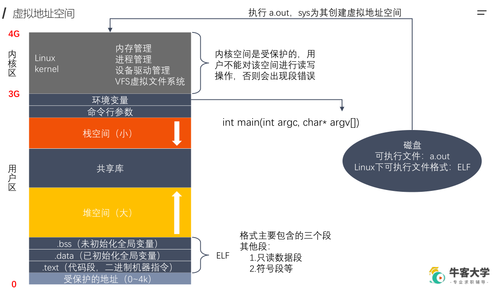
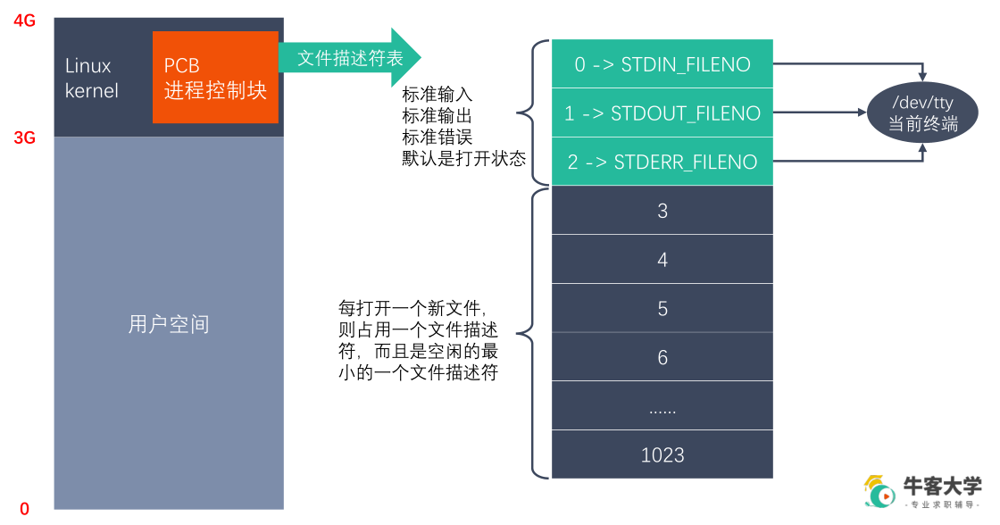

# C++服务器搭建

## 1.服务器环境及基础知识

### 1.1开发环境

####Linux操作系统 + GCC/G++（C语言、C++语言编译器）

<table>
    <tr>
        <td>编译器</td>
        <td>基于某种规范，将C++代码转换成可执行程序的某种程序</td>
        <td>MSVC</td>
        <td>GCC/G++</td>
        <td>Clang</td>
    <tr>
    <tr>
        <td>编译环境</td>
        <td>编译器程序需要的具体运行环境（操作系统）</td>
        <td>Windows</td>
        <td>Linux、Cygwin、MinGW</td>
        <td>MacOs</td>
    <tr>
    <tr>
        <td>编辑器</td>
        <td>全称代码编辑器，编写代码的工具程序</td>
        <td colspan = "3">VScode, Vim, Notepad++</td>
    <tr>
    <tr>
        <td>IDE</td>
        <td>包括项目文件管理器、代码编辑器、调试器、编译器等各种开发时的工具集合，通常打包安装</td>
        <td colspan = "3">Visio Studio/编辑器+MinGW/GCC</td>
    <tr>
</table>

```shell
安装命令： sudo apt install gcc g++  
查看版本： gcc/g++ -v/--version
```

#### 汇编过程



#### gcc/g++常见参数

| 参数 | 作用 |
| -------- | ------------ |
| -std | 指定标准版本 |
| -c | 只激活预处理,编译,和汇编，只把程序做成obj文件 |
| -o | 制定输出目标名称,默认是a.out |
| -I    | 编译时，需要另一个文件，用于设定另一个文件，功能就相当于在代码中使用#include |
| -L dir | 制定编译的时候，搜索库的路径。比如你自己的库，可以用它制定目录，不然编译器将只在标准库的目录找。这个dir就是目录的名称，可无空格 |
| -l lib | 制定编译的时候，使用的库，lib就是库的名称，可无空格          |
| -fpic  | 编译器就生成位置无关目标码.适用于共享库(shared library) |
| -fPIC | 编译器就输出位置无关目标码.适用于动态连接(dynamic linking) |
| -shared | 将使用动态库为默认选项 |

###1.2库文件

计算机上某一类文件，类似代码仓库，无法单独运行，保密性强，方便分发

静态库：程序链接时，复制进程序中

动态库：程序运行时，系统加载进内存让程序调用

####静态库

Linux：libxxx.a — lib固定前缀，xxx为库名称，.a为后缀

Windows：libxxx.lib

**制作调用过程**

```shell
gcc/g++ -c *.c -I ../include //引入头文件，生成.o文件
ar rcs libxxx.a xxx.o xxx.o //生成静态库文件
gcc/g++ main.cpp -o a.out -I ../include -L dir -l xxx//引入库文件，运行程序
```

#### 动态库

Linux：libxxx.so — lib固定前缀，xxx为库名称，.so为后缀

Windows：libxxx.dll

**制作过程**

```shell
gcc/g++ -c -fpic/-fPIC *.c  -I ../include //引入头文件，生成.o文件
gcc/g++ -shared *.o -o libxxx.so  //生成动态库文件
```

**常见问题**

运行过程中缺失依赖库


```shell
ldd app.out//检查app.out动态库依赖关系
```



**解决方法**

需要知道库的绝对路径（动态载入器**ld-linux.so**搜索**DT_RPATH**段->环境变量**LD_LIBRARY_PATH**->**/etc/ld.so.cache**文件列表->**/lib/,/usr/lib**目录）

主要通过增加路径至**LD_LIBRARY_PATH**和**/etc/ld.so.cache**文件进行添加

```shell
添加路径：(env查看环境变量，key-value，用：隔开)
1.终端级别添加
export LD_LIBRARY_PATH=$LD_LIBRARY_PATH:/home/ostrich/Linux/Static_Library/library/lib
(关掉终端失效)
echo $LD_LIBRARY_PATH (查看环境变量)

2.用户级别添加(home目录下)
方法1：修改.bashrc(单一用户配置)
vim .bashrc
末尾添加(shift + g)
export LD_LIBRARY_PATH=$LD_LIBRARY_PATH:/home/ostrich/Linux/Static_Library/library/lib
source(.) .bashrc
方法2：修改/etc/profile(全局用户配置)
sudo vim /etc/profile
末尾添加
export LD_LIBRARY_PATH=$LD_LIBRARY_PATH:/home/ostrich/Linux/Static_Library/library/lib
. /etc/profile

4.系统级别添加(home目录下)
sudo vim /etc/ld.so.conf
/home/ostrich/Linux/Static_Library/library/lib
sudo ldconfig
```

####两种库的对比

| 库类型 | 优点                                                         | 缺点                                                       |
| ------ | ------------------------------------------------------------ | ---------------------------------------------------------- |
| 静态库 | 1.加载速度快；<br>2.发布程序无需提交静态库，移植方便         | 1.消耗系统资源，浪费内存；<br>2.更新、部署、发布麻烦；     |
| 动态库 | 1.实现进程间资源共享；（共享库）<br>2.更新、部署、发布简单；<br>3.可以控制何时加载动态库； | 1.加载速度比静态库慢；<br>2.发布程序时需提供依赖的动态库； |

### 1.3Makefile

https://seisman.github.io/how-to-write-makefile/（**跟我一起写 Makefile_陈皓**）

命名：一般采用Makefile

makefile规则：

```makefile
目标...: 依赖...
	命令（shell 命令）
    ...
```

实际编写makefile文件：

```makefile
#v1.0
app:sub.cpp add.cpp mult.cpp div.cpp main.cpp
        g++ sub.cpp add.cpp mult.cpp div.cpp main.cpp -o app
        
#v2.0
app:sub.o add.o mult.o div.o main.o
        g++ sub.o add.o mult.o div.o main.o -o app

sub.o:sub.cpp
        g++ -c sub.cpp -o sub.o

add.o:add.cpp
        g++ -c add.cpp -o add.o

mult.o:mult.cpp
        g++ -c mult.cpp -o mult.o

div.o:div.cpp
        g++ -c div.cpp -o div.o

main.o:main.cpp
        g++ -c main.cpp -o main.o

#v3.0 使用变量及模式规则
# $<：第一个依赖文件；
# $@：目标；
# $^：所有不重复的依赖文件，以空格分开
obj = sub.o add.o mult.o div.o main.o
target = app
xx = g++

$(target):$(obj)
        $(xx) $(obj) -o $(target)
        
#模式规则：所有的.o文件都由对应的.cpp文件生成
%.o:%.cpp
        $(xx) -c $< -o $@

#v4.0
# wildcard：获取指定目录下指定类型的文件列表；
# patsubst：查找替换；
# .PHONY:伪目标
src = $(wildcard ./*.cpp)#在当前目录下找到所有.cpp文件
obj = $(patsubst %.cpp,%.o,$(src))#在src变量里把所有的.cpp文件转换成.o文件
#obj = $(src:%.cpp=%.0)
target = app
xx = g++

$(target):$(obj)
        $(xx) $(obj) -o $(target)

%.o:%.cpp
        $(xx) -c $< -o $@

.PHONY:clean#clean是伪target，即使存在clean文件依然能执行命令
clean:
        rm -rf $(obj) $(target)

```

###1.4GDB调试

Linux系统下的代码调试工具，和gcc一起构成完整的开发环境（程序启动、断点、检查、修改）

```shell
g++ program.cpp -o program -g -Wall
#'-g'代表在可执行文件中加入源码信息，保证GDB调试能找到源文件
#'-Wall'表示打开所有warning
```

GDB启动、退出、查看代码

```shell
#启动、退出
gdb program
quit/q

#设置变量
set args 10 20
show args

#帮助命令
help

#查看文件代码
list/l #从默认位置显示
list/l 行号 #从指定行号显示
list/l 函数名 #从指定函数显示

#查看其他文件代码
list/l 文件名:行号
list/l 文件名:函数名

#设置显示行数
show list/listsize
set list/listsize 新显示行数
```

GDB设置断点

```shell
#设置断点
b/break 行号
b/break 函数名 
b/break 文件名：行号
b/break 文件名：函数名
b/break 10 if i==5 #设置条件断点，用于循环

#查看断点
i/info b/break

#删除断点
d/del/delete b/break 断点编号

#取消/使用断点
dis/disable 断点编号
ena/enable 断点编号

```

GDB调试

```shell
#运行代码
start #程序开始调试，停在第一行
run #程序开始调试，遇到断点停止（常用）
finish #跳出函数体
until #跳出循环（循环体中无断点）

#单步调试
c/continue #继续运行到下一个断电
n/next #向下执行一行，不进入函数体
s/step #向下单步调试，遇到函数进入函数体

#变量操作
set var 变量名=变量值 #设置变量，常用在循环
p/print 变量名 #打印变量值
ptype 变量名 #打印变量类型

#自动变量操作
display 变量名 #自动打印变量值
i/info display #查看自动变量
undisplay 编号 #取消自动变量
```

### 1.5文件IO









#### Linux下的文件类型

一般用`'ll'`或者`ls -l`查看文件类型时，首位字符代表文件类型

- 普通（`-`）：包括文本文件、编译好的二进制文件、特殊格式的数据文件。
- 目录（`d`）：目录也是文件，允许以操作文件的方式来操作目录。
- 块（`b`）：存储数据以供系统存取的接口设备，也就是硬盘。磁盘中存储数据时，是按块为单位进行存储的，在系统内部按固定大小转移数据。/dev/dsk 对应的为块设备。
- 字符（`c`）：串口设备、键盘、鼠标等，以不定长度转移数据。/dev/rdsk 对应的为字符设备。
- 套接字（`s`）：通常用于网络数据连接。
- 管道（`p`）：用以解决多个程序同时存取一个文件所造成的错误。
- 链接（`l`）：在Linux系统中的链接文件，包括硬链接、软连接两种。


####man命令

man:查看某个命令的具体参数和使用方法

| 编号 |                 说明                  |                    解释                    |
| :--: | :-----------------------------------: | :----------------------------------------: |
|  1   | Executable programs or shell commands |             **标准Linux命令**              |
|  2   |             System calls              |            **系统调用（内核）**            |
|  3   |           Library functions           |                 **库函数**                 |
|  4   |            Special devices            |    **设备说明**（通常在/dev下可以找到）    |
|  5   |             File formats              |                **文件格式**                |
|  6   |                 Games                 |                 游戏娱乐等                 |
|  7   |             Miscellaneous             |                   杂乱项                   |
|  8   |    System administration commands     | **系统管理员命令**（通常针对**root**用户） |
|  9   |            Kernel routines            |              常规**内核**文件              |

#### open()

```C
int open(const char *pathname, int flags);
int open(const char *pathname, int flags, mode_t mode);
```

