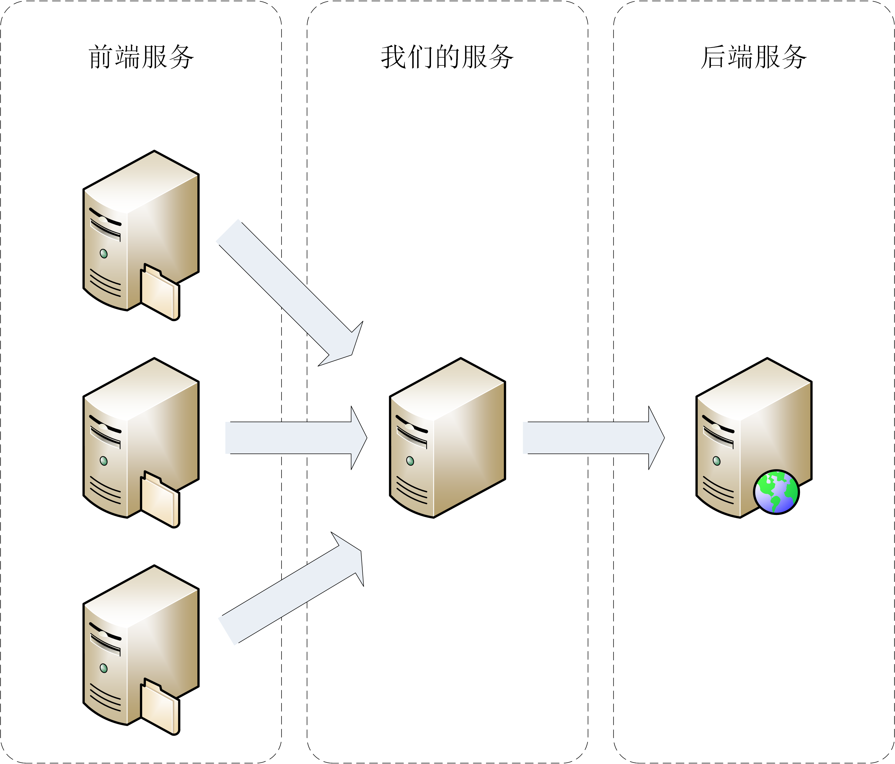

# 书店应用

## 项目设计

简单来说，就是书店销售记录管理，从多个渠道把书号、销售册数、销售额都汇总起来，做个统计分析，再把数据定期上报到后台。

C++ Primer 里的书店程序是本地运行的，为了演示课程里讲到的的 C++ 特性，我把它改成了网络版。不过，拓扑结构并不复杂，我画了张图，你可以看一下。



主要应用的是单一职责原则、接口隔离原则和包装外观模式。这里我也画了一个 UML 图，可以帮助你理解程序的架构。


完整代码：https://github.com/chronolaw/cpp_study/tree/master/section5

##代码实现

###核心头文件

定义核心头文件：cpplang.hpp。集中 C++ 标准头和语言相关的定义，被用于其他所有的源文件。

写的时候有文件头注释以及"Include guard"

```c++
// Copyright (c) 2020 by Chrono

#ifndef _CPP_LANG_HPP        // Include guard
#define _CPP_LANG_HPP        // Include guard

#include <cassert>           // C++标准头文件
...

#endif  //_CPP_LANG_HPP
```

在核心头文件里，我们还可以利用预处理编程，使用宏定义、条件编译来屏蔽操作系统、语言版本的差异，增强程序的兼容性。比如，这里检查了 C++ 的版本号，然后定义了简化版的 deprecated 和 static_assert ：

```C++
// must be C++11 or later
#if __cplusplus < 201103
#   error "C++ is too old"
#endif  // __cplusplus < 201103

// [[deprecated]]
#if __cplusplus >= 201402
#   define  CPP_DEPRECATED [[deprecated]]
#else
#   define  CPP_DEPRECATED [[gnu::deprecated]]
#endif  // __cplusplus >= 201402

// static_assert
#if __cpp_static_assert >= 201411
#   define STATIC_ASSERT(x) static_assert(x)
#else
#   define STATIC_ASSERT(x) static_assert(x, #x)
#endif
```

### 自旋锁

有了核心头文件之后，我们的 C++ 程序就有了一个很好的起点，就可以考虑引入多线程，提高吞吐量，减少阻塞。

在多线程里保护数据一般要用到互斥量（Mutex），但它的代价太高，所以设计了一个自旋锁，它使用了原子变量，所以成本低，效率高。

自旋锁被封装为一个 SpinLock 类，所以就要遵循一些 C++ 里常用的面向对象的设计准则，比如用 final 禁止继承、用 default/delete 显式标记构造 / 析构函数、成员变量初始化、类型别名等。

```C++
class SpinLock final                        // 自旋锁类
{
public:
    using this_type   = SpinLock;          // 类型别名
    using atomic_type = std::atomic_flag;
public:
    SpinLock() = default;                 // 默认构造函数
   ~SpinLock() = default;

    SpinLock(const this_type&) = delete;  // 禁止拷贝
    SpinLock& operator=(const this_type&) = delete;
private:
    atomic_type m_lock {false};            // 成员变量初始化
};
```

在编写成员函数的时候，为了尽量高效，需要给函数都加上 noexcept 修饰，表示绝不会抛出异常

```C++
public:
  void lock() noexcept              // 自旋锁定，绝不抛出异常
  {
    for(;;) {                      // 无限循环
      if (!m_lock.test_and_set()) { // 原子变量的TAS操作
          return;                  // TAS成功则锁定
      }
      std::this_thread::yield();   // TAS失败则让出线程
    }
  }

  void unlock() noexcept           // 解除自旋锁定，绝不抛出异常
  {
    m_lock.clear();
  }
```

为了保证异常安全，在任何时候都不会死锁，还需要利用 RAII 技术再编写一个 LockGuard 类。它在构造时锁定，在析构时解锁，这两个函数也应该用 noexcept 来优化：

```C++
class SpinLockGuard final                      // 自旋锁RAII类，自动解锁
{
public:
    using this_type      = SpinLockGuard;      // 类型别名
    using spin_lock_type = SpinLock;
public:
    SpinLockGuard(const this_type&) = delete;  // 禁止拷贝
    SpinLockGuard& operator=(const this_type&) = delete;
public:
    SpinLockGuard(spin_lock_type& lock) noexcept
        : m_lock(lock)
    {
        m_lock.lock();
    }

   ~SpinLockGuard() noexcept
   {
       m_lock.unlock();
   }
private:
    spin_lock_type& m_lock;
};
```

这样自旋锁就完成了，有了它就可以在多线程应用里保护共享的数据，避免数据竞争。

### 网络通信

自旋锁比较简单，但多线程只是书店程序的基本特性，它的核心关键词是“网络”，所以下面就来看看服务里的“重头”部分：网络通信。

在现代 C++ 里，应当避免直接使用原生 Socket 来编写网络通信程序。这里选择 ZMQ 作为底层通信库，它不仅方便易用，而且能够保证消息不丢失、完整可靠地送达目的地。

程序里使用 ZmqContext 类来封装底层接口（包装外观），它是一个模板类，整数模板参数用来指定线程数，在编译阶段就固定了 ZMQ 的多线程处理能力。

对于 ZMQ 必需的运行环境变量（单件），我使用了一个小技巧：以静态成员函数来代替静态成员变量。这样就绕过了 C++ 的语言限制，不必在实现文件“*.cpp”里再写一遍变量定义，全部的代码都可以集中在 hpp 头文件里：

```C++
template<int thread_num = 1>        // 使用整数模板参数来指定线程数
class ZmqContext final
{
public:
    static                          // 静态成员函数代替静态成员变量
    zmq_context_type& context()
    {
        static zmq_context_type ctx(thread_num);
        return ctx;
    }
};
```

然后，实现两个静态工厂函数，创建收发数据的 Socket 对象。

这里要注意， zmq.hpp 的源码内部实际上是使用了异常来处理错误的。所以，这里不能在函数后面加上 noexcept 修饰，同时也就意味着，在使用 ZMQ 的时候，必须要考虑异常处理。

```C++
public: 
  static
  zmq_socket_type recv_sock(int hwm = 1000)    // 创建接收Socket
  {
    zmq_socket_type sock(context(), ZMQ_PULL); // 可能抛出异常
    
    sock.setsockopt(ZMQ_RCVHWM, hwm);

    return sock;
  }

  static
  zmq_socket_type send_sock(int hwm = 1000)   // 创建发送Socket
  {
    zmq_socket_type sock(context(), ZMQ_PUSH); // 可能抛出异常

    sock.setsockopt(ZMQ_SNDHWM, hwm);

    return sock;
  }
```

现在，有了 ZmqContext 类，书店程序的网络基础也就搭建出来了，后面就可以用它来收发数据了。

###配置文件解析（*）

接下来是解析配置文件的类 Config。大多数程序都会用到配置文件来保存运行时的各种参数，常见的格式有 INI、XML、JSON，等等。

但我通常会选择把 Lua 嵌入 C++，用 Lua 脚本写配置文件。这么做的好处在哪里呢？Lua 是一个完备的编程语言，所以写起来就非常自由灵活，比如添加任意的注释，数字可以写成“m × n”的运算形式。而 INI、XML 这些配置格式只是纯粹的数据，很难做到这样，很多时候需要在程序里做一些转换工作。

另外，在 Lua 脚本里，我们还能基于 Lua 环境写一些函数，校验数据的有效性，或者采集系统信息，实现动态配置。总而言之，就是把 Lua 当作一个“可编程的配置语言”，让配置“活起来”。给你看一下配置文件的代码吧，里面包含了几个简单的值，配置了服务器的地址、时间间隔、缓冲区大小等信息：

```c++
config = {

    -- should be same as client
    -- you could change it to ipc
    zmq_ipc_addr = "tcp://127.0.0.1:5555",

    -- see http_study's lua code
    http_addr = "http://localhost/cpp_study?token=cpp@2020",

    time_interval = 5,  -- seconds

    max_buf_size = 4 * 1024,
}
```

Config 类使用 shared_ptr 来管理 Lua 虚拟机，因为封装在类里，所以，你要注意类型别名和成员变量初始化的用法（第 5 讲）：

```c++
class Config final                  // 封装读取Lua配置文件
{
public:
    using vm_type      = std::shared_ptr<lua_State>;   // 类型别名
    using value_type   = luabridge::LuaRef;
public:
    Config() noexcept               // 构造函数
    {
        assert(m_vm);
        luaL_openlibs(m_vm.get());  // 打开Lua基本库
    }
   ~Config() = default;             // 默认析构函数
private:
    vm_type     m_vm                 // 类型别名定义Lua虚拟机
      {luaL_newstate(), lua_close};  // 成员变量初始化
};
```

加载 Lua 脚本的时候还要注意一点，外部的脚本有可能会写错，导致 Lua 解析失败。但因为这个问题极少出现，而且一出现就很严重，没有配置就无法走后续的流程，所以非常适合用异常来处理。

load() 函数不会改变虚拟机成员变量，所以应该用 const 修饰，是一个常函数：

```C++
public:
  void load(string_view_type filename) const  // 解析配置文件
  {
    auto status = luaL_dofile(m_vm.get(), filename.c_str());

    if (status != 0) {                       // 出错就抛出异常
        throw std::runtime_error("failed to parse config");
    }
  }
```

为了访问 Lua 配置文件里的值，我决定采用“key1.key2”这样简单的两级形式，有点像 INI 的小节，这也正好对应 Lua 里的表结构。想要解析出字符串里的前后两个 key，可以使用正则表达式，然后再去查询 Lua 表。因为构造正则表达式的成本很高，所以把正则对象都定义为成员变量，而不是函数里的局部变量。正则的匹配结果（m_what）是“临时”的，不会影响常量性，所以要给它加上 mutable 修饰。

```C++
private:
  const   regex_type  m_reg {R"(^(\w+)\.(\w+)$)"};
  mutable match_type  m_what;              // 注意是mutable
```

在 C++ 正则库的帮助下，处理字符串就太轻松了，拿到两个 key，再调用 LuaBridge 就可以获得 Lua 脚本里的配置项。不过，为了进一步简化客户代码，把 get() 函数改成了模板函数，显式转换成 int、string 等 C++ 标准类型，可读性、可维护性会更好。

```C++
public:
  template<typename T>                    // 转换配置值的类型
  T get(string_view_type key) const      // const常函数
  {
    if (!std::regex_match(key, m_what, m_reg)) {  // 正则匹配
        throw std::runtime_error("config key error");// 格式错误抛异常
    }

    auto w1 = m_what[1].str();            // 取出两个key
    auto w2 = m_what[2].str();

    auto v = getGlobal(                  // 获取Lua表
                m_vm.get(), w1.c_str());

    return LuaRef_cast<T>(v[w2]);        // 取表里的值，再做类型转换
  }
```

到这里呢，Config 类也就完成了，可以轻松解析 Lua 格式的配置文件。

### 数据定义

首先，书本的销售记录用的是 SalesData 类，它是书店程序数据统计的基础。如果是实际的项目，SalesData 会很复杂，因为一本书的相关信息有很多。但是，这个例子只是演示，所以就简化了一些，基本的成员只有三个：ID 号、销售册数和销售金额。

在定义 SalesData 类的时候，集中归纳一下。这些都是写 C++ 代码时的“惯用法”，让代码更可读可维护：

- 适当使用空行分隔代码里的逻辑段落；
- 类名使用 CamelCase，函数和变量用 snake_case，成员变量加“m_”前缀；
- 在编译阶段使用静态断言，保证整数、浮点数的精度；
- 使用 final 终结类继承体系，不允许别人产生子类；
- 使用 default 显示定义拷贝构造、拷贝赋值、转移构造、转移赋值等重要函数；
- 使用委托构造来编写多个不同形式的构造函数；
- 成员变量在声明时直接初始化；
- using 定义类型别名；
- 使用 const 来修饰常函数；
- 使用 noexcept 标记不抛出异常，优化函数。

列的点比较多，你可以对照着源码来进行理解：

```C++
class SalesData final                   // final禁止继承
{
public:
  using this_type = SalesData;         // 自己的类型别名
public:
  using string_type       = std::string;         // 外部的类型别名
  using string_view_type  = const std::string&;
  using uint_type         = unsigned int;
  using currency_type     = double;

  STATIC_ASSERT(sizeof(uint_type) >= 4);          // 静态断言
  STATIC_ASSERT(sizeof(currency_type) >= 4); 
public:
  SalesData(string_view_type id, uint_type s, currency_type r) noexcept         // 构造函数，保证不抛出异常
      : m_id(id), m_sold(s), m_revenue(r)
  {}  

  SalesData(string_view_type id) noexcept         // 委托构造
      : SalesData(id, 0, 0)
  {}  
public:
  SalesData() = default;                 // 显式default
 ~SalesData() = default;

  SalesData(const this_type&) = default;
  SalesData& operator=(const this_type&) = default;

  SalesData(this_type&& s) = default;  // 显式转移构造
  SalesData& operator=(this_type&& s) = default;
private:
  string_type m_id        = "";         // 成员变量初始化
  uint_type   m_sold      = 0;
  uint_type   m_revenue   = 0;
public:
  void inc_sold(uint_type s) noexcept        // 不抛出异常
  {
      m_sold += s;
  }
public:
  string_view_type id() const noexcept       // 常函数，不抛出异常
  {
      return m_id;
  }

  uint_type sold() const noexcept           // 常函数，不抛出异常
  {
      return m_sold;
  }
};
```

需要注意的是，代码里显式声明了转移构造和转移赋值函数，这样，在放入容器的时候就避免了拷贝，能提高运行效率。

### 序列化

SalesData 作为销售记录，需要在网络上传输，所以就需要序列化和反序列化。这里选择MessagePack，小巧轻便，并且使用方便，只要在类定义里添加一个宏，就可以实现序列化：

```c++
public:
  MSGPACK_DEFINE(m_id, m_sold, m_revenue);  // 实现MessagePack序列化功能
```

为了方便使用，还可以为 SalesData 增加一个专门序列化的成员函数 pack()：

```c++
public:
  msgpack::sbuffer pack() const          // 成员函数序列化
  {
      msgpack::sbuffer sbuf;
      msgpack::pack(sbuf, *this);

      return sbuf;
  }
```

不过你要注意，写这个函数的同时也给 SalesData 类增加了点复杂度，在一定程度上违反了单一职责原则和接口隔离原则。

如果在今后的实际项目中遇到类似的问题，就要权衡后再做决策，确认引入新功能带来的好处大于它增加的复杂度，尽量抵制扩充接口的诱惑，否则很容易写出“巨无霸”类。

### 数据存储与统计

有了销售记录之后，我们就可以定义用于数据存储和统计的 Summary 类了。Summary 类依然要遵循刚才的那些基本准则。从 UML 类图里可以看到，它关联了好几个类，所以类型别名对于它来说就特别重要，不仅可以简化代码，也方便后续的维护，你可要仔细看一下源码：

```c++
class Summary final                       // final禁止继承
{
public:
  using this_type = Summary;               // 自己的类型别名
public:
  using sales_type        = SalesData;       // 外部的类型别名
  using lock_type         = SpinLock;
  using lock_guard_type   = SpinLockGuard;

  using string_type       = std::string;
  using map_type          =                  // 容器类型定义
          std::map<string_type, sales_type>;
  using minmax_sales_type =
          std::pair<string_type, string_type>;
public:
  Summary() = default;                   // 显式default
 ~Summary() = default;

  Summary(const this_type&) = delete;    // 显式delete
  Summary& operator=(const this_type&) = delete;
private:
  mutable lock_type   m_lock;            // 自旋锁
  map_type            m_sales;           // 存储销售记录
};
```

Summary 类的职责是存储大量的销售记录，所以需要选择恰当的容器。考虑到销售记录不仅要存储，还有对数据的排序要求，所以选择可以在插入时自动排序的有序容器 map。

不过要注意，这里我没有定制比较函数，所以默认是按照书号来排序的，不符合按销售量排序的要求。（如果要按销售量排序的话就比较麻烦，因为不能用随时变化的销量作为 Key，而标准库里又没有多索引容器，所以，你可以试着把它改成 unordered_map，然后再用 vector 暂存来排序）。

为了能够在多线程里正确访问，Summary 使用自旋锁来保护核心数据，在对容器进行任何操作前都要获取锁。锁不影响类的状态，所以要用 mutable 修饰。因为有了 RAII 的 SpinLockGuard，所以自旋锁用起来很优雅，直接构造一个变量就行，不用担心异常安全的问题。你可以看一下成员函数 add_sales() 的代码，里面还用到了容器的查找算法。

```c++
public:
  void add_sales(const sales_type& s)       // 非const
  {
    lock_guard_type guard(m_lock);          // 自动锁定，自动解锁

    const auto& id = s.id();                // const auto自动类型推导

    if (m_sales.find(id) == m_sales.end()) {// 查找算法
        m_sales[id] = s;                    // 没找到就添加元素
        return;
    }

    m_sales[id].inc_sold(s.sold());        // 找到就修改销售量
    m_sales[id].inc_revenue(s.revenue());
  }
```

Summary 类里还有一个特别的统计功能，计算所有图书销量的第一名和最后一名。这用到了 minmax_element 算法。又因为比较规则是销量，而不是 ID 号，所以还要用 lambda 表达式自定义比较函数：

```c++
public:
  minmax_sales_type minmax_sales() const    //常函数
  {
    lock_guard_type guard(m_lock);          // 自动锁定，自动解锁

    if (m_sales.empty()) {                  // 容器空则不处理
      return minmax_sales_type();
    }

    auto ret = std::minmax_element(        // 求最大最小值
      std::begin(m_sales), std::end(m_sales),// 全局函数获取迭代器
      [](const auto& a, const auto& b)    // 匿名lambda表达式
      {
          return a.second.sold() < b.second.sold();
      });

    auto min_pos = ret.first;            // 返回的是两个迭代器位置
    auto max_pos = ret.second;

    return {min_pos->second.id(), max_pos->second.id()};
  }
```

### 服务器端主线程

客户端程序比较简单，只是序列化，再用 ZMQ 发送，看GitHub上的源码即可。

服务器端在 main() 函数开头，首先要加载配置文件，然后是数据存储类 Summary，再定义一个用来计数的原子变量 count，这些就是程序运行的全部环境数据：

```C++
Config conf;                  // 封装读取Lua配置文件
conf.load("./conf.lua");      // 解析配置文件

Summary sum;                  // 数据存储和统计
std::atomic_int count {0};    // 计数用的原子变量
```

接下来的服务器主循环，使用 lambda 表达式，引用捕获上面的那些变量：

```C++
auto recv_cycle = [&]()      // 主循环lambda表达式
{
  ...
}; 
```

主要的业务逻辑其实很简单，就是 ZMQ 接收数据，然后 MessagePack 反序列化，存储数据。不过为了避免阻塞、充分利用多线程，在收到数据后，就把它包装进智能指针，再扔到另外一个线程里去处理了。这样主循环就只接收数据，不会因为反序列化、插入、排序等大计算量的工作而阻塞。

```C++
auto recv_cycle = [&]()               // 主循环lambda表达式
{
  using zmq_ctx = ZmqContext<1>;       // ZMQ的类型别名

  auto sock = zmq_ctx::recv_sock();   // 自动类型推导获得接收Socket

  sock.bind(                           // 绑定ZMQ接收端口 
    conf.get<string>("config.zmq_ipc_addr"));   // 读取Lua配置文件

  for(;;) {                           // 服务器无限循环
    auto msg_ptr =                   // 自动类型推导获得智能指针
      std::make_shared<zmq_message_type>();

    sock.recv(msg_ptr.get());        // ZMQ阻塞接收数据

    ++count;                          // 增加原子计数
 
    std::thread(            // 再启动一个线程反序列化存储，没有用async
    [&sum, msg_ptr]()                // 显式捕获，注意！！
    {
        SalesData book;

        auto obj = msgpack::unpack(      // 反序列化
                    msg_ptr->data<char>(), msg_ptr->size()).get();
        obj.convert(book);

        sum.add_sales(book);            // 存储数据
    }).detach();                        // 分离线程，异步运行
  }                                     // for(;;)结束
};                                      // recv_cycle lambda
```

你要特别注意 lambda 表达式与智能指针的配合方式，要用值捕获而不能是引用捕获，否则，在线程运行的时候，智能指针可能会因为离开作用域而被销毁，引用失效，导致无法预知的错误。有了这个 lambda，现在就可以用 async来启动服务循环：

```C++
auto fu1 = std::async(std::launch::async, recv_cycle);
fu1.wait();
```

现在我们就能够接收客户端发过来的数据，开始统计了。

###数据外发线程

recv_cycle 是接收前端发来的数据，我们还需要一个线程把统计数据外发出去。实现一个 lambda 表达式：log_cycle。采用 HTTP 协议，把数据打包成 JSON，发送到后台的某个 RESTful 服务器。

搭建符合要求的 Web 服务不是件小事，所以这里为了方便测试，我联动了一下《透视 HTTP 协议》，用那里的 OpenResty 写了个的 HTTP 接口：接收 POST 数据，然后打印到日志里，你可以参考第 41 讲在 Linux 上搭建这个后台服务。

log_cycle 其实就是一个简单的 HTTP 客户端，所以代码的处理逻辑比较好理解，要注意的知识点主要有三个，都是前面讲过的：读取 Lua 配置中的 HTTP 服务器地址和周期运行时间；JSON 序列化数据；HTTP 客户端发送请求。

```C++
auto log_cycle = [&]()              // 外发循环lambda表达式
{
  // 获取Lua配置文件里的配置项
  auto http_addr = conf.get<string>("config.http_addr");
  auto time_interval = conf.get<int>("config.time_interval");

  for(;;) {                        // 无限循环
    std::this_thread::sleep_for(time_interval * 1s);  // 线程睡眠等待

    json_t j;                        // JSON序列化数据
    j["count"] = static_cast<int>(count);
    j["minmax"] = sum.minmax_sales();

    auto res = cpr::Post(            // 发送HTTP POST请求
               cpr::Url{http_addr},
               cpr::Body{j.dump()},
               cpr::Timeout{200ms}  // 设置超时时间
    );

    if (res.status_code != 200) {    // 检查返回的状态码
        cerr << "http post failed" << endl;
    }
  }                                   // for(;;)
};                                    // log_cycle lambda
```

然后，还是要在主线程里用 async() 函数来启动这个 lambda 表达式，让它在后台定时上报数据。

```C++
auto fu2 = std::async(std::launch::async, log_cycle);
```

这样，整个书店程序就全部完成了，试着去编译运行一下看看吧。

### 课下作业

添加 try-catch，处理可能发生的异常；

写一个动态库，用 Lua/Python 调用 C++ 发送请求，以脚本的方式简化客户端测试；

把前端与服务器的数据交换格式改成 JSON 或者 ProtoBuf，然后用工厂类封装序列化和反序列化功能，隔离接口。

再补充一点，在动手实践的过程中，你还可以顺便练习一下 Git 的版本管理：不要直接在 master 分支上开发，而是开几个不同的 feature 分支，测试完确认没有问题后，再合并到主干上。