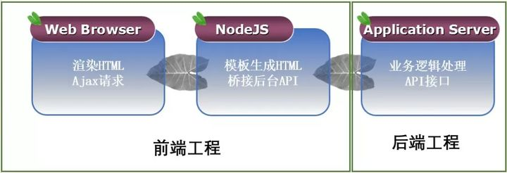

# 后端服务器设计

## 设计原则

1. 关注收益而非技术
   - 降低技术门槛
   - 系统稳定运行
   - 简化、自动化降低成本
2. 以应用和API为开发视角
3. 最主流和成熟的技术
4. 完备性比性能更重要
5. 制定并服从标准、规范和最佳实践
   - 需要注意的规范：
     - 服务间调用的协议标准及规范：Restful API路径, HTTP 方法、状态码、标准头、自定义头等，返回数据 JSon Scheme……等
     - 命名标准及规范：用户 ID，服务名、标签名、状态名、错误码、消息、数据库……等等
     - 日志监控规范：日志格式，监控数据，采样要求，报警……等等
     - 配置规范：操作系统配置、中间件配置，软件包……等等
     - 中间件规范：数据库，缓存、消息队列……等等
     - 软件和开发库版本统一：整个组织架构内，软件或开发库的版本最好每年都升一次级，然后在各团队内统一。
6. 架构扩展性和可运维性
7. 对控制逻辑进行全面收口
   - **你要选择容易进行业务逻辑和控制逻辑分离的技术**。这里，Java 的 JVM+字节码注入+AOP 式的Spring 开发框架，会带给你太多的优势。
   - **你要选择可以享受“前人种树，后人乘凉”的有技术红利的技术**。如：有庞大社区而且相互兼容的技术，如：Java, Docker, Ansible，HTTP，Telegraf/Collectd……
   - **中间件你要使用可以 支持HA集群和多租户的技术**。这里基本上所有的主流中间件都会支持 HA 集群方式的。
8. 不要迁就老旧系统的技术债务
9. 不要依赖自己的经验，要依赖于数据和学习
10. 千万要小心 X – Y 问题，要追问原始需求
11. 激进胜于保守，创新与实用并不冲突

## 前端技术

前端语言：JavaScript ：Web 的编程语言， CSS ：控制多重网页的样式和布局，超文本标记语言（英语：HyperText Markup Language，简称：HTML）：创建网页的标准标记语言。

前后端交互：AJAX、JSON、JSONP

web前端开发三大主流框架：Angularjs、React、Vue

- Angularjs：客户端的JavaScript MVC开源框架，可用于开发动态Web应用程序，是一个处理web页面的前端框架，基于HTML和JavaScript
- React：开源的JavaScript库（也可转换web开发框架），用于开发web应用程序的用户界面
- Vue：开源JavaScript框架，能够开发单页面应用程序，还可以用作Web应用程序框架，目的在于简化Web开发。

## 前后端分离

### Node.js

简单的说 Node.js 就是运行在服务端的 JavaScript。

- 引入NodeJS层作为服务桥接层，NodeJS层由前端工程师负责搭建完成。

- 通过NodeJS服务器在服务器端运行JS脚本，可以让前端人员快速入门搭建自己的服务器。

- 引入NodeJS,可以预先在服务端的内网环境完成大量的前端逻辑计算和页面渲染工作，提升前端的访问性能

  

  1. 浏览器请求服务端的Node.js
  2. Node.js再发起HTTP去请求API
  3. API接口输出JSON数据给Node.js
  4. Node.js收到JSON数据后再渲染出html页面
  5. Node.js直接将html页面flush到浏览器

## 服务器分类

后端服务器种类主要分为WEB服务器以及应用服务器：

​		WEB服务器：主要用来发布静态资源（html、css等静态资源文件），如Nginx服务器、Apache以及CDN服务器等。WEB服务器对于静态资源发布以及静态文件缓存有极大的优势。

​		应用服务器：主要用来发布应用程序代码（[http://ASP.NET](https://link.zhihu.com/?target=http%3A//ASP.NET)、PHP、JAVA等），如Tomcat、IIS服务器等。WEB服务器一般通过公网VIP或者SLB等方式对外提供外网服务。应用服务器一般只运行在内网环境，无法通过外网方式直接访问应用服务器资源，这样也是对应用服务器的一种网络安全保护。

## 通信协议

### 网络编程

（1）IPC（Inter-process communication）：单机中运行的进程之间的相互通信

​			进程B能直接调用进程A上的功能（进程：正在运行的程序实例）

（2）RPC（Remote procedure call）远程过程调用：多机器中的进程通过网络协议传输调用进程申请

​		实现RPC：多线程、Socket、I/O等（线程：进程中的一个单一顺序控制流，一个进程中可以并发多个线程，每条线程并行执行不同的任务）

|  方法  |                          定义                          |                             实例                             |
| :----: | :----------------------------------------------------: | :----------------------------------------------------------: |
| 多线程 |        软件或者硬件上实现多个线程并发执行的技术        |   https://baike.baidu.com/item/%E5%A4%9A%E7%BA%BF%E7%A8%8B   |
| Socket | 网络中不同主机上的应用进程之间进行双向通信的端点的抽象 | https://baike.baidu.com/item/%E5%A5%97%E6%8E%A5%E5%AD%97/9637606?fromtitle=socket&fromid=281150 |
|  I/O   |                  计算机接口输入/输出                   |     https://baike.baidu.com/item/i%2Fo/84718?fr=aladdin      |

​		**PRC框架及发展历程**：

- ONC RPC （开放网络计算的远程过程调用），OSF RPC（开放软件基金会的远程过程调用）

- CORBA（Common Object Request Broker Architecture公共对象请求代理体系结构）

- DCOM（分布式组件对象模型），COM+

- Java RMI

- .NET Remoting

  早期框架复杂、环境单一，RMI只能在Java中使用。Remoting喜只能在.NET平台上使用（.NET平台：开发各类应用的“框架”和程序“运行环境”https://muzimin.blog.csdn.net/article/details/102753875?spm=1001.2101.3001.6650.1&utm_medium=distribute.pc_relevant.none-task-blog-2%7Edefault%7ECTRLIST%7Edefault-1.showsourcetag&depth_1-utm_source=distribute.pc_relevant.none-task-blog-2%7Edefault%7ECTRLIST%7Edefault-1.showsourcetag）

  ---------------------------------------------------------------------------------------------------------------------------------------------

- XML-RPC，SOAP，Web Service

- PHPRPC，Hessian，JSON-RPC

- Microsoft WCF，WebAPI

- ZeroC Ice，Thrift，GRPC

- Hprose（目前来看最优）

​		**通讯过程**：建立通讯（TCP连接）->寻址（机器地址、端口）->序列化、反序列化（编组）->返回值

​	

**PRC优势：**

  - 隐藏底层的通讯细节（不需要直接处理Socket通讯或Http通讯）

- 请求响应模型。客户端发起请求，服务器返回响应（类似于Http的工作方式）

  - 在使用形式上像调用本地函数（或方法）一样去调用远程的函数（或方法）。

（PRC细节：https://blog.csdn.net/bwh0520/article/details/80148405）

客户端和服务器通信格式

HTTP通信协议

## 负载均衡（运维）

Nginx搭建服务器

## 反向代理

Nginx（一台负载均衡、一台反向代理）

## 业务编程

tomcat服务器：

​		服务器业务框架：Stuts2、Spring MVC、Spring、Hibernate、MyBatis

​		常用体系：

1. Struts2+Spring+Hibernate：

   Struts2：

   Spring：

   Hibernate：

2. Spring MVC+Spring+MyBatis：

   Spring：

   Spring MVC：

   MyBatis：

## 数据库

## 缓存

本地缓存：guava cache

缓存服务器：redis

## 开发工具

maven svn git 

## 主要问题

### 高性能

1. 页面大量HTTP调用
2. HTTP页面渲染逻辑复杂
3. 移动设备性能差
4. 前端数据处理逻辑复杂
5. 后端数据查询较慢

### 解决方案

1. CDN：静态资源放在CDN服务器，减轻web服务器访问压力
2. Node.js:作为桥接层
3. 业务数据静态化：特定业务需求数据静态化

### 

# C++框架

- [值得推荐的C/C++框架和库](https://blog.csdn.net/lxj434368832/article/details/110664912?utm_medium=distribute.pc_relevant.none-task-blog-2~default~baidujs_baidulandingword~default-1.highlightwordscore&spm=1001.2101.3001.4242.2)

- [c++分布式游戏服务器架构设计](https://blog.csdn.net/weixin_42869573/article/details/101751416)
