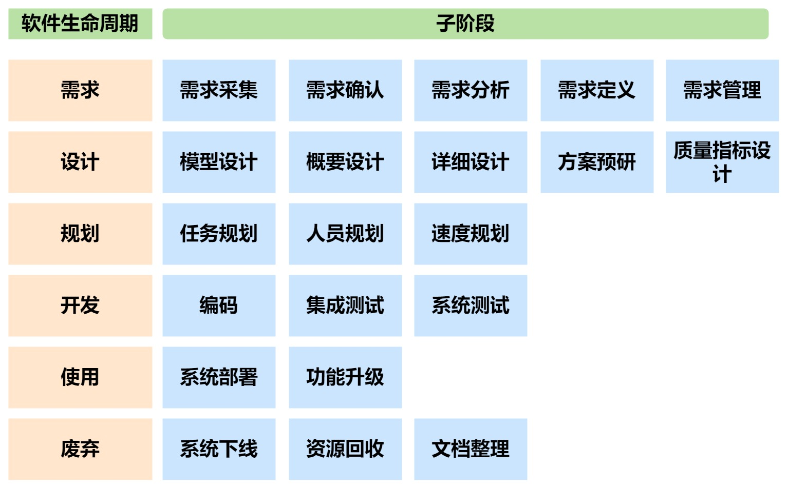

# 高性能架构之道

## 一、高性能架构

### 1.软件质量（8）

效率、功能、兼容、可移植、安全、可靠、易用、可维护

**高性能** ：在效率和可靠性上表现较好（吞吐量TPS、QPS+并发数+平均响应时间+可靠性指标：平均无故障时间）

​			效率：时间效率、容量、资源利用率

​			可靠性：成熟度、可用性、容错性、可恢复性

##二、分流设计

### 1.内容分发网络（CDN）

静态资源（图像、视频等）布置在网络的多个位置（CDN节点），核心系统布置在一个位置便于维护（源站）

**分发原理**：基于DNS完成CDN节点到源站的请求拦截

- 用户给出ip地址，LocalDNS服务器将ip发送给CDN服务商的DNS服务器，返回CDN节点ip，用户再通过CDN节点访问请求资源（计网细节），最终客户以为访问的是源站，但实际上先访问CDN节点，如果请求资源没有缓存，再将请求发送至源站

### 2.多地址直连

将内容分发过程简化为**“ 请求服务+地址获取 ”**

用户、注册中心、服务节点（用例代表：Dubbo）

- 用户每一次的请求服务都需要访问注册中心，

### 3.反向代理

对外呈现一个ip地址，但实际上分发给多个服务器（正向代理：所有请求由一个代理服务器发给内部）

反向代理层级（OSI七层模型：物理、数据链路、网络、传输（TCP/UDP）、会话、表示、应用（HTTP/FTP））

- 四层反向：IP和端口进行转发（实现简单、效率高）
- 七层反向：根据HTTP/FTP请求的具体内容转发（信息多，转发智能）——Nginx

**Nginx搭建反向代理**

主要使用upstream模块（主要是指后方服务节点），将请求按照某种策略转发给后方服务节点

- 轮询
- 加权轮询
- 请求源IP地址哈希

可以在nginx.conf文件中完成配置，也可以嵌入脚本完成相应功能

## 三、服务并行设计

请求分流（外部）到达系统后，多个节点服务同一个请求（内部）

并行（一定是同时进行）、并发（宏观同时，微观有先后顺序）

### 1.集群系统

一个系统布置多个相同节点（配置相同、执行相同任务）

#### 1.1无状态节点集群

节点给出的结果与该节点之前收到请求无关，让系统满足无状态条件，只能选用恒等类接口（查询类）

存在问题：协作问题（并行唤醒）

#### 1.2单一服务节点集群

单一服务节点集群保证从用户角度而言是一个节点，实际上可能多个用户对应一个节点（游戏服务器选择）

- 节点之间隔离，但节点配置、服务相同
- 节点保存用户的上下文信息（状态）

存在问题：节点隔离，导致出现问题用户信息丢失，容错性差

#### 1.3信息共享节点集群

单一节点集群扩容，多个服务节点共享信息池（数据库），每个节点都能读取到用户上下文信息

协作问题可以采用分布式锁的方法解决。

存在问题：受到信息池容量和读写性能的影响

#### 1.4信息一致的节点集群

每一个节点拥有自己的信息池，但是需要保证每一个节点信息池的信息同步（适用于读多写少的场景）

**与分布式系统不同，分布式系统每个节点是异构的，从属于不同模块，这里的节点是同构的，只是分担高并发的压力**

存在问题：分布式一致问题（信息池同步存在时间差）

解决方法：

- 线性一致性：两阶段提交、三阶段提交（造成每个节点吞吐量影响大）
- 最终一致性：异步消息中心（造成集群出现读写不一致）

### 2.分布式系统

将单体应用拆分成多个子应用，提升系统的压力承载能力

拆分方法：优先对大的单体应用进行拆分，成为分布式系统，当分布式系统拆分导致并发过高造成性能瓶颈时，再将并发过高的子应用部署成集群系统

存在问题：分布式一致问题（信息池同步存在时间差）

解决方法：

- 线性一致性：两阶段提交、三阶段提交（造成每个节点吞吐量影响大）
- 最终一致性：异步消息中心（造成集群出现读写不一致）

### 3.微服务系统

分布式系统中子应用和应用间存在严格的从属关系，造成性能浪费

微服务系统：每个微服务可以独立提供功能，也可以自由组合后对外提供服务，高内聚，低耦合，提升系统成熟度

存在问题：复杂度高、运维复杂、通信时延（RPC框架）

## 四、运算并发

### 1.多进程

程序如果是多进程，则多进程运算可能并行可能并发；单核CPU只能并发，多核CPU调度可并行可并发

进程是资源分配的最小单位，独立地址空间（Linux中进程切换：内核态-地址空间切换-寄存器-计数器-线程栈-用户态，原来缓存的旧数据失效，重新预热）

优势：隔离性强（不影响其他进程）

### 2.多线程

一个进程内部，一般有一个或多个线程，线程共享内存，因此线程间切换效率更高

#### 2.1线程状态及切换

新建、可运行、运行中（占用CPU资源）、阻塞（等待阻塞、同步阻塞、其他阻塞）、结束

#### 2.2.线程应用场景

1.提升效率；2.实现异步操作

#### 2.3线程池

线程提供线程回收利用的途径（实现方法：Executor类）

操作：

1. 创建线程池
2. 提交任务，线程池自动分配线程并发完成任务
3. 关闭线程池

#### 2.4多线程资源协作（以Java为例）

1. 内存模型：将Java内存分为主内存（线程共享）和工作内存（线程独享）
2. 禁止并发修改：临界区的使用（给主内存加排他锁）
3. 线程安全对象：Java内置的线程安全对象（原子对象）
4. 线程独享资源：ThreadLocal包装对象属于线程独有（空间换时间）注意**线程池回收时不改变ThreadLocal，因此重新使用时可能包含上次的数据，需要初始化**

#### 2.5多线程进度协作

- 分总式同步：等多个线程中最慢的完成才触发下一动作
- 栅栏式同步：当线程数达到一定数目时，才能一起跨过栅栏继续运行
- 总分总式同步：主任务-》子任务123-》主任务，充分利用CPU多核性
- 信号量：维护许可，线程请求许可再运行，可以灵活调度多线程

### 3.多协程

CPU中存在多个方法，一个方法被阻塞，调用另一个方法去执行（效率高）

### 4.总结

- 利用多核性能且资源完全隔离，使用多进程
- 利用多核性能不需要资源完全隔离，使用多线程
- 充分利用CPU性能，使用多协程

## 五、输入输出设计

同步与异步：针对调用方和被调用方的消息通信机制，同步：一直等回应，异步：立刻回应，好了再通知

阻塞与非阻塞：调用方调用操作到得到回应前的状态，阻塞：调用操作后被挂起（睡着了），非阻塞：调用操作后处于活跃状态（干其他事情）

### 1.IO模型

面向缓存的IO模型，存在数据接收、数据复制两个阶段

#### 1.1阻塞式IO模型（BIO）

同步、阻塞

调用方调用IO操作后被挂起，数据接收、复制完成后，调用方被唤醒

编程简单，语句返回时，读写操作完成，适用于输入输出操作较少的情况

#### 1.2非阻塞式IO模型

同步、非阻塞

数据接收阶段非阻塞（不断轮询）直到接收完成进入复制阶段，较少使用

#### 1.3信号驱动式IO模型

监听阶段异步、非阻塞

调用方监听的IO操作完成后，通知调用方触发IO操作，较少使用

#### 1.4复用式IO模型（NIO）

监听同步、阻塞

利用监听函数，监听多个IO操作（阻塞），一个调用方监听和处理多个IO操作（比BIO的优势）

#### 1.5异步式IO模型（AIO）

异步、非阻塞

减少了监听函数通知调用方的过程，直接由监听函数自动触发IO操作，完成后再通知调用方

## 六、数据库设计优化

//MySql.md

## 七、缓存设计

应用场景：1.读多写少；2.查询时间较长的场景；

提高缓存收益：

- 减少缓存键的生成时间
- 减少缓存键的检索时间
- 减少缓存内容转换时间
- 提高缓存内容的命中率

###1.缓存键值

键的生成：无碰撞（哈希算法）、高效生成、高效比较（MyBatis的CacheKey类）

值的存储：序列数据（写入缓存前序列化，取出前反序列化）、对象数据（创建map作为缓存）

**常见问题：**重复引用（甲修改了缓存数据，乙读到修改后的数据，但数据库数据可能没改）

###2.缓存更新

####2.1时效性更新

被动更新，放弃了实时一致性，转为最终一致性

缓存提供读，写数据直接写入提供方，更新清空后再从提供方备份（引发读写不一致）

实时性要求不高场景使用

#### 2.2主动更新

**Cache Aside机制：**读数据正常读，写数据先写入提供方，之后删除缓存中数据备份（顺序重要）

**Read/Write Through机制：**避免缓存不一致，读写直接对缓存操作，再由缓存写入提供方（要求缓存可靠）

**Write Behind机制：**缓存同步写入影响性能，换成异步操作，但容易造成更新丢失

### 3.缓存清理

假设：如果一条数据被访问，接下来还会被继续访问

####3.1时效式清理

到达生存时间时，自动清理，简单易用

无法限定空间，短时间内出现密集查询时，缓存空间急剧增大

#### 3.2数目阈值式清理

限制数据数目，从而限定空间

**FIFO策略**

先进先出（定长队列）

**LRU策略**

近期最少使用（少用的先清理）排序树或者链表

####3.3非强引用式清理

空间充足，占据更多空间，节约时间；空间紧张，减少占用（弹性缓存空间）

JVM（强引用、软引用、弱引用、虚引用）利用可达性分析法找出垃圾对象（软引用、弱引用）回收

### 4.缓存风险

- 缓存穿透：缓存和提供方都没有数据，调用方一直调用查询（空值备份）
- 缓存雪崩：缓存突然失效，大量请求直作用于提供方（时效清理添加随机时间、非强引用+LRU策略）
- 缓存击穿：缓存中的高频访问数据突然失效，访问直接作用于提供方（修改清理机制）
- 缓存预热：除了Read/Write Through和Write Behind机制，其他机制均存在预热问题，即数据较少命中率低（避免突然给缓存接入大量请求）

### 5.缓存位置

只要能够带来收益，可以存在在系统中的任何位置（越前收益越高）

#### 5.1客户端缓存

在客户端中设置缓存，减轻服务端压力，根据客户端类型选择不同的客户端缓存

####5.2静态缓存

后端给出的静态数据的缓存，适合缓存与用户无关的元素、页面等通用性强的数据

#### 5.3服务缓存

根据不同服务模块的运行结果进行缓存（动态结果生成过程）

#### 5.4数据库缓存

数据库本身属于服务缓存，但因为有IO、检索等过程，因此也可以设计数据库缓存

### 6.写缓存

服务调用写缓存，一般由数据处理方从写缓存中提取数据，而非写缓存主动向处理方写入（避免负载过大，异步处理）

## 八、可靠性

使用可靠性 < 固有可靠性

串联可靠性 < 冗余可靠性（实现拜占庭容错：恶意模块，响应给出错误值） < 并联可靠性（实现非拜占庭容错：异常模块，不响应）

解决恶意模块—需要更多信息—需要正常工作模块数越多—可靠性越低

可靠性设计：1.消除单点依赖；2.增加旁路（串联变成并联）；3.集群系统

##九、应用保护

系统状态（6种）：所有用户+所有服务、所有用户+部分服务、部分用户+部分服务、无服务能恢复、系统崩溃不扩散、系统崩溃并扩散

###1.隔离

避免失效蔓延（采用线程池，调用服务时取出一个线程操作而不是主线程操作，堵塞时不会影响其他线程池）

### 2.限流

#### 2.1时间窗限流

固定的时间间隔内允许一定数量的请求进入服务（新请求进入和放行同步）

主要问题：请求突刺，短时间内大量请求涌入造成冲击

#### 2.2漏桶限流

当时间窗缩小到一个请求时的情况，需要一个队列存储请求，队列满时将后续请求丢弃（请求进入和放行不同步）

问题：要么造成请求堵塞，要么浪费处理能力（固定频率释放请求）

#### 2.3令牌限流

漏桶限流的基础上增加反馈，一个请求只有拿到令牌才能发动给服务进行处理

令牌由服务根据自身负载情况提供

问题：存在大量请求和大量令牌时，容易造成请求突刺（调整令牌数量）

### 3.降级

请求频率一定时，降低系统平均响应时间，减少并发数

降级：保证其他条件不变，减少请求操作，裁剪掉耗时操作

### 4.熔断

下游服务响应过慢、错误过多时，直接切断下游服务，不再调用

与**降级区别**：降级是服务自身给出，降低自身平均响应时间操作；熔断是服务调用方绕过服务提供方直接的操作；

问题：切断下游服务有可能影响上游服务（由系统自己完成）

### 5.恢复

需要注意恢复时大量请求涌入，因此需要限制请求数量（预热过程）

操作：撤销限流、消除降级、关闭熔断器

## 十、前端高性能

浏览器访问地址==访问HTML页面地址，

- HTML文件解析生成DOM树
- CSS文件解析成样式规则
- js文件通过事件监听函数对解析过程进行调整和修改

主要耗时过程：下载资源（Redis等缓存方式、高网速），页面解析（主要环节）

页面解析调试：chrome DevTools工具（F12)

### 1.下载优化

#### 1.1资源压缩

减少资源体积，增加下载速度（cookie作缓存，压缩js和http请求）

#### 1.2减少请求

**资源合并**

小图片合并成大图片，使用时候采用偏移使用图片的不同部分

**长连接和长轮询**

在一个长连接中完成多次信息传输，避免频繁连接请求（前后端需要一直维护连接）

全双工提高了长轮询的工作效率，前端可以在后端发出消息时展开操作（WebSocket协议支持长轮询）

#### 1.3资源缓存

CDN静态资源缓存，客户端本地缓存——均可提高前端工作效率

页面缓存（Cache-Control属性）设置页面资源缓存（问题：服务器更新无法及时缓存）

- 更新文件名时产生新文件重新缓存：index.html不允许缓存，但关联文件可以缓存
- 后端验证缓存的有效性：基于最后修改时间或者版本号（携带Etag属性，更有效）

### 2.页面解析

#### 2.1顺应解析流程

CSS文件引用放在HTML文件头部，在DOM树解析时完成CSS文件的下载和解析

js文件放在尾部，浏览器遇到js文件便运行，停止了DOM树的解析过程

**回流和重绘**

回流：页面元素变化后造成页面所有元素重新计算位置的过程

重绘：元素发生变化后从重新展示页面

#### 2.2应用新型前端框架

直接修改DOM树，而不是删除后重建（DOM树的比较优化算法：虚拟DOM）

### 3.懒加载

只加载最基础元素，之后随着操作进行局部加载

### 4.预操作

DNS预解析，提前下载本页面大资源或者下一页面大资源

## 十一、架构设计理论

###1.架构风格

####1.1管道过滤器风格

定义一组包含输入输出和处理功能的构件，串联在一起完成各项功能，适用于模块化、流式处理工作（UNIX系统管道采“|”用这种风格）

####1.2面向对象架构风格

将系统视作多个高内聚低耦合的类，实例化类对象后完成系统工作

#### 1.3基于组件架构风格

将应用拆分成可重用的组件，每个组件只暴露相应的功能接口（便于积累组件，完成后续开发工作）

#### 1.4事件驱动型

通过广播事件触发其他构件，而不是主动调用，根据事件的不同触发不同的操作

#### 1.5分层架构

将软件划分为不同的层级，下层逐层向上层提供服务（OSI7层模型）

#### 1.6C/S架构风格

**客户端/服务器架构：**

- 服务器：
  - 接受客户端数据
  - 完成数据库读写操作
  - 负责数据库安全维护工作
- 客户端：
  - 向服务器端发送/接受数据
  - 对用户输入/返回数据进行处理
  - 提供操作界面，展示数据

**三层C/S架构（添加一个应用服务器）**

- 服务器：
  - 接受客户端数据
  - 完成数据库读写操作
  - 负责数据库安全维护工作
- 客户端：
  - 向服务器端发送/接受数据
  - 提供操作界面，展示数据
- 应用层
  - 数据处理工作

#### 1.7B/S架构

类似三层C/S架构，客户端变为浏览器，实现无客户端运行

### 2.软件生命周期

##十二、高性能架构实践

https://github.com/yeecode/MatrixAuth
